<h1 align="center">Adventure Awaits</h1>

## Table of Contents

- [Validators](#validator)

  - [HTML5 validator](#html-validator)
  - [CSS3 validator](#css3-validator)
  - [JS validator](#js-validator)
  - [Python validator](#py-validator)

- [Testing](#testing)

  - [Functionality Testing](#test-functionality)
  - [Responsiveness](#responsiveness)
  - [Browser compatibility](#browser-compatibility)
  - [Performance Testing](#performance-testing)

  - [User Stories](#user-stories)

### Validators

#### HTML5 validator
Vaidate by URI [HTML5 Validator](https://validator.w3.org/#validate_by_uri)
Test result : No errors beyond this which occurs in the base.html thus on all pages.

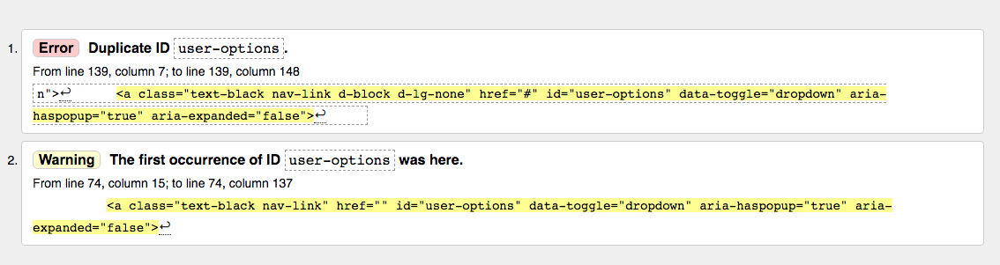

#### CSS3 validator
Validate by direct input [CSS Validator](https://jigsaw.w3.org/css-validator/)
Test result : No errors

#### JS validator
Validate by direct input [JavaScript Validator](https://jshint.com/)
- Test result : No Errors

#### Python validator
Validate by direct input [Python Validator](http://pep8online.com/)
Test result : No Error

## Testing

### Functionality Testing

- Navigation bar
  - When the navbar links are clicked, they take the user to the revelent page.
  - Clicking on the logo takes the user to the home page.

- Subscribe link
  - Located at the bottom of each page and link works.

- Links
  - All internal and external links are tested to make sure that all pages are connected and opened.

### Responsiveness
- Galaxy S5 - Good
- iPhone 5/6/7/8 - Good
- iPad - Good
- iPad Pro - Good
- Desktop 1024px - Good
- Desktop >1200px - Good

### Browser compatibility
- Chrome: Responsiveness, Appearance and Functionality- Good
- Safari: Responsiveness and Appearance and Functionality- Good

### Performance Testing

- Test in Dev Tools Lighthouse.

   - Run a report
     - In Chrome, go to the URL you want to check.
     - Open DevTools.
     - Click on the Lighthouse tab.
     - Choose desktop or mobile, leave all categories enabled.
     - Click Generate report.

- A Lighthouse report in Chrome DevTools

    - Home page Desktop and Mobile
      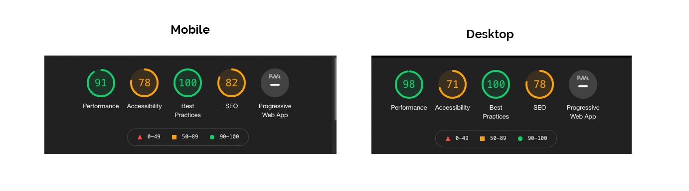

    - All clothing page Desktop and Mobile
      

    - Products(all) page Desktop and Mobile
      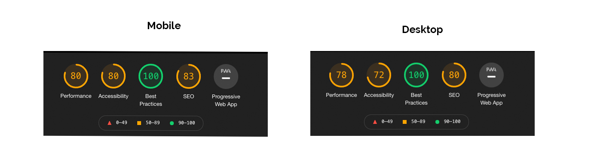

    - All equipment page Desktop and Mobile
      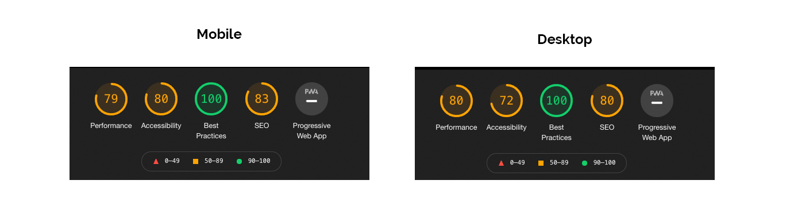

    - Contact page Desktop and Mobile
      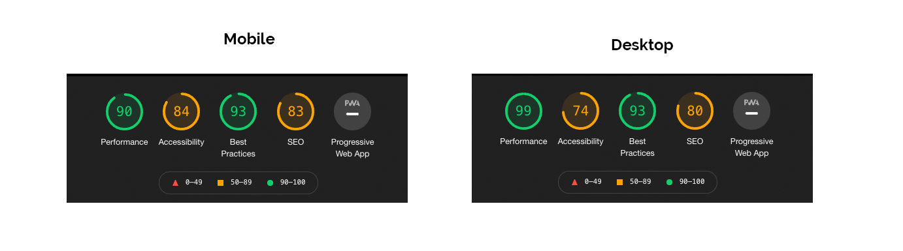

    - Bag page Desktop and Mobile
      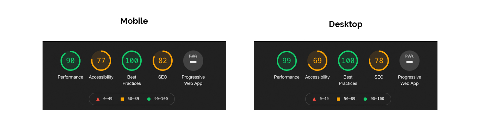

    - Checkout success Desktop and Mobile
      

    - Register page Desktop and Mobile
      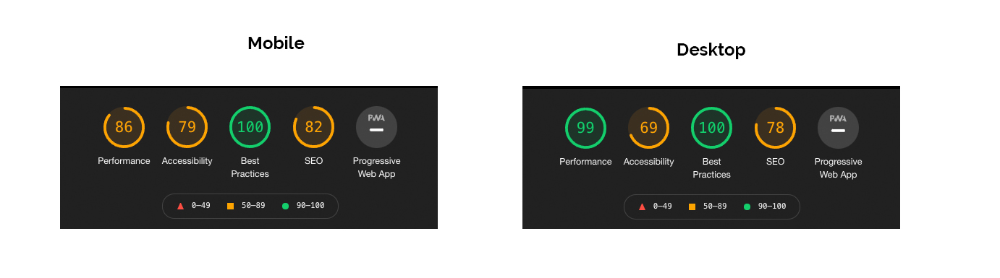

    - Login page Desktop and Mobile
      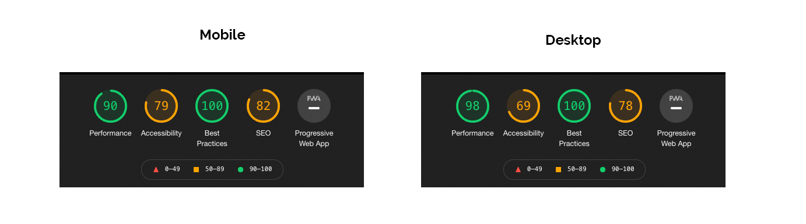

 

### Testing User Stories

- User

1. As a user I'd like to easily navigate around the site.
2. As a user I'd like to view a list of products.
3. As a user I'd like to search for individual products.
4. As a user I'd like to sort the products by categories.
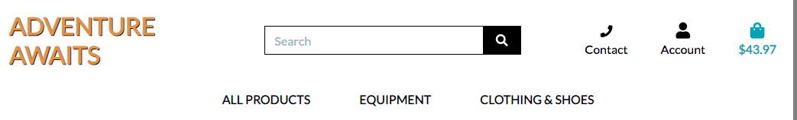

5. As a user I'd like to view individual products.
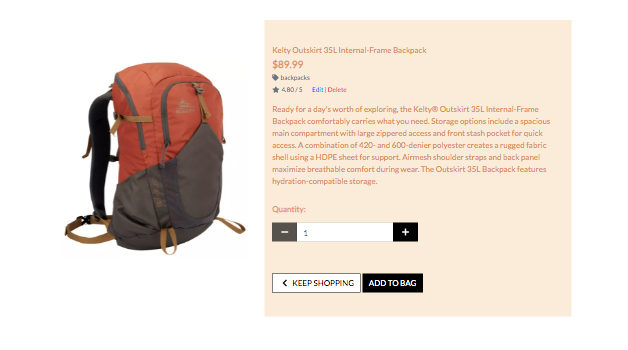

6. As a user I'd like to easily register.

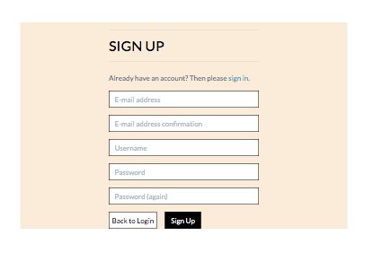

7. As a registered user I'd like to easily login and logout.
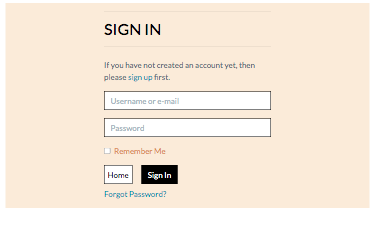
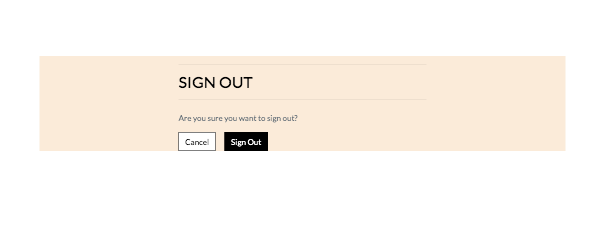

8. As a registered user I'd like to have a profile with a previous order history.

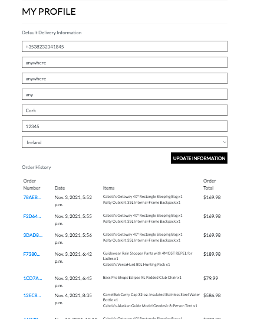

9. As a user I want to select the quantity of the products when purchasing.

10. As a user I want a confirmation message that the purchase was successful.

11. As a user I want to view the products in the shopping bag before purchasing.
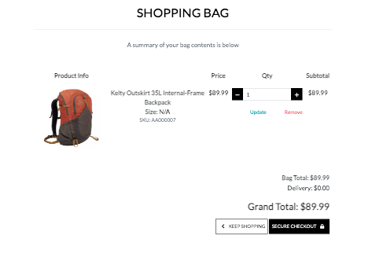

- Site Owner

12. As the owner of the site I'd like to add new products.

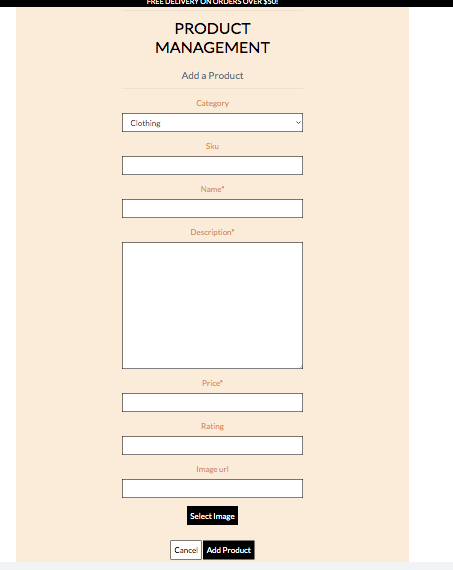

13. As the owner of the site I'd like to edit/update already existing categories and products.
14. As the owner of the site I'd like to delete already existing categories and products.

- Back To [Readme](README.md)